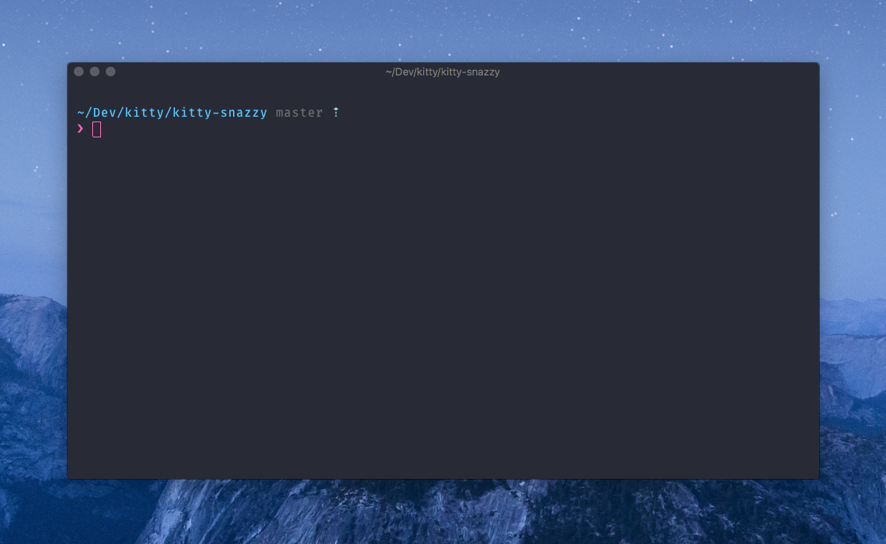

# kitty-snazzy

> Elegant [kitty](https://github.com/kovidgoyal/kitty) theme with bright colors. Based on [hyper-snazzy](https://github.com/sindresorhus/hyper-snazzy/) by [Sindre Sorhus](https://sindresorhus.com).




## Install

Download this file and place it alongside your kitty config file.
```
$ curl -o ~/.config/kitty/ https://raw.githubusercontent.com/connorholyday/kitty-snazzy/master/snazzy.conf
```

Place this line at the bottom of your config file:
```
# ~/.config/kitty/kitty.conf

include snazzy.conf
```

## Related

- [iterm2-snazzy](https://github.com/sindresorhus/iterm2-snazzy) - iTerm2 version
- [terminal-snazzy](https://github.com/sindresorhus/terminal-snazzy) - Terminal version
- [konsole-snazzy](https://github.com/miedzinski/konsole-snazzy) - Konsole version
- [vscode-snazzy](https://github.com/Tyriar/vscode-snazzy) - VS Code version
- [emacs-snazzy](https://github.com/weijiangan/emacs-snazzy) - Emacs version
- [termite-snazzy](https://github.com/kbobrowski/termite-snazzy) - Termite version
- [deepin-snazzy](https://github.com/xxczaki/deepin-snazzy) - Linux Deepin terminal version
- [vim-snazzy](https://github.com/connorholyday/vim-snazzy) - Vim version
- [base16-snazzy](https://github.com/h404bi/base16-snazzy-scheme) - Base16 version
- [kitty-snazzy](https://github.com/connorholyday/kitty-snazzy) - Kitty version


## License

MIT © [Connor Holyday](https://holyday.me)
